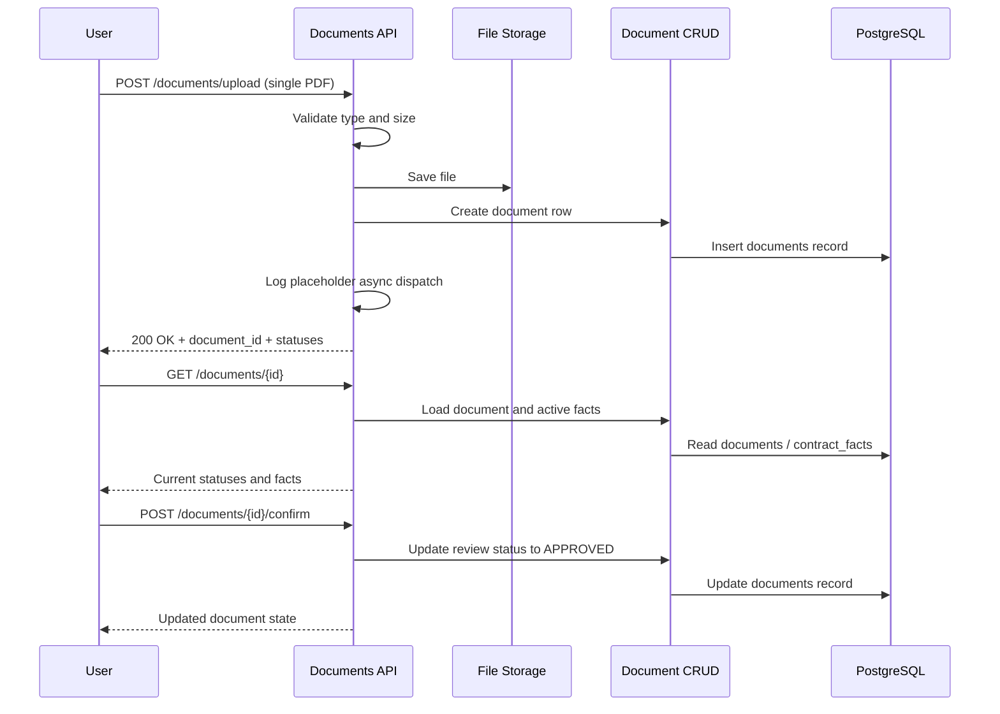

# Document Upload & Processing

This document describes the current phase-1 backend flow for document upload, document status polling, and manual review.

## Current Scope

The upload endpoint is intentionally lightweight in the current implementation:

* it validates a single PDF upload;
* saves the file to local storage;
* creates a `documents` row with `review_status=PENDING_REVIEW` and `processing_status=QUEUED`;
* accepts optional controlled bulk-ingestion metadata;
* logs a placeholder asynchronous dispatch event.

It does not yet perform inline PDF parsing, LLM fact extraction, or Qdrant indexing.

## Current Lifecycle

### Upload

1. The authenticated user calls `POST /api/v1/documents/upload` with one PDF file.
2. The API validates file type and file size.
3. The file is written to the configured upload directory.
4. The API creates a database row in `documents` with:
   * file metadata;
   * owner id;
   * `review_status=PENDING_REVIEW`;
   * `processing_status=QUEUED`;
   * `indexing_status=NOT_INDEXED`;
   * optional `batch_id`, `ingestion_source`, `queue_priority`, and `trusted_import`.
5. The API emits a placeholder "queued for async processing" log event and returns immediately.

### Polling

1. The frontend or an operator calls `GET /api/v1/documents/{id}`.
2. The API returns:
   * current review, processing, and indexing statuses;
   * file metadata;
   * `last_error` when present;
   * active extracted facts from `contract_facts` when they exist;
   * batch metadata when present.

### Manual Confirmation

1. The user calls `POST /api/v1/documents/{id}/confirm`.
2. The API marks the document as approved in the review lifecycle.
3. In the current phase, confirmation does not trigger indexing.

## Sequence Diagram

