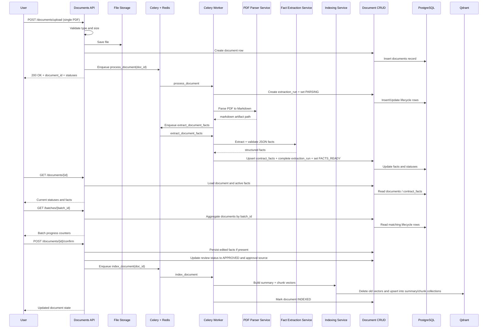

# Document Upload & Processing

This document describes the current backend flow for document upload, asynchronous parsing/fact extraction, document approval, idempotent indexing, document status polling, and batch progress visibility.

## Current Scope

The upload endpoint stays lightweight in the current implementation:

* it validates a single PDF upload;
* saves the file to local storage;
* creates a `documents` row with `review_status=PENDING_REVIEW` and `processing_status=QUEUED`;
* accepts optional controlled bulk-ingestion metadata;
* enqueues `process_document` into Celery (`document-high-priority` or `document-bulk` queue).

Background workers then:

* parse PDF into Markdown artifacts;
* extract structured contract facts with LLM + Pydantic validation;
* persist extraction runs and facts in PostgreSQL;
* update lifecycle statuses (`QUEUED -> PARSING -> FACTS_READY`, or `FAILED` on errors);
* move approved documents into `APPROVED` and `QUEUED` for indexing;
* write approved vectors into separate Qdrant collections for summaries and chunks.

## Current Lifecycle

### Upload

1. The authenticated user calls `POST /api/v1/documents/upload` with one PDF file.
2. The API validates file type and file size.
3. The file is written to the configured upload directory.
4. The API creates a database row in `documents` with:
   * file metadata;
   * owner id;
   * `review_status=PENDING_REVIEW`;
   * `processing_status=QUEUED`;
   * `indexing_status=NOT_INDEXED`;
   * approval audit fields left empty until a reviewer or trusted bulk flow approves the document;
   * optional `batch_id`, `ingestion_source`, `queue_priority`, and `trusted_import`.
5. The API enqueues `process_document` on the selected Celery queue and returns immediately.

### Background Worker Processing

1. `process_document` creates an `extraction_runs` row and sets `documents.processing_status=PARSING`.
2. The parser service reads the PDF and writes a Markdown artifact.
3. The worker enqueues `extract_document_facts` (rate-limited) on the same queue family.
4. `extract_document_facts` loads Markdown, calls the LLM extraction service, validates the JSON payload, and writes/upserts `contract_facts`.
5. On success:
   * `extraction_runs.status=SUCCEEDED`;
   * `documents.processing_status=FACTS_READY`;
   * `documents.active_extraction_version` is updated.
6. If the document came from a trusted bulk import and passed validation:
   * `documents.review_status=APPROVED`;
   * `documents.approval_source=TRUSTED_IMPORT`;
   * the indexing task is enqueued automatically.
7. On failure:
   * `extraction_runs.status=FAILED`;
   * `documents.processing_status=FAILED`;
   * `documents.last_error` and structured error details are persisted.

### Polling

1. The frontend or an operator calls `GET /api/v1/documents/{id}`.
2. The API returns:
   * current review, processing, and indexing statuses;
   * file metadata;
   * `last_error` when present;
   * active extracted facts from `contract_facts` when they exist;
   * batch metadata when present.

### Batch Status

1. Operators call `GET /api/v1/batches/{batch_id}`.
2. The API aggregates matching document rows and returns:
   * raw lifecycle counters by status domain;
   * derived counters for progress views (`queued`, `parsing`, `ready_for_review`, `failed`, `approved`, `indexed`).

### Manual Confirmation

1. The user calls `POST /api/v1/documents/{id}/confirm`.
2. The API optionally accepts edited `facts` and writes them back to the active `contract_facts` version.
3. The API marks the document as approved, records the approval source, and enqueues `index_document`.
4. The approval path remains the default review boundary before indexing.

## Sequence Diagram

