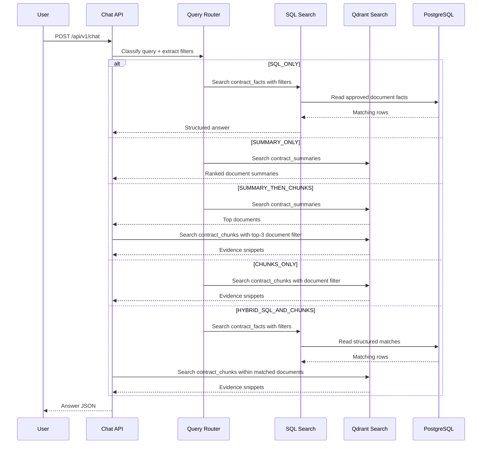

# Query Orchestration

This document describes the current search orchestration used by the chat endpoints.

## Description
The backend no longer sends every query through a single vector-search path. Instead, `app/services/query_router.py` classifies each request into one of five route types:

* `SQL_ONLY`
* `SUMMARY_ONLY`
* `SUMMARY_THEN_CHUNKS`
* `CHUNKS_ONLY`
* `HYBRID_SQL_AND_CHUNKS`

The router also extracts structured filters such as `year`, `supplier`, and ISO date ranges. The selected route then drives either PostgreSQL fact search, summary-first Qdrant search, chunk-scoped retrieval, or a hybrid SQL-plus-chunk answer.

The current `/api/v1/chat` and workspace chat flows both call the orchestration layer in `app/services/search_orchestration.py`. The legacy `rag.py` module still exists for backwards compatibility and reference, but it is no longer the primary chat path.

## Routing Summary

* `SQL_ONLY`: used for list, report, and structured reporting queries.
* `SUMMARY_ONLY`: used for discovery and broad topic-search queries.
* `SUMMARY_THEN_CHUNKS`: used for explanation-style questions that need document discovery first and evidence second.
* `CHUNKS_ONLY`: used for contract-scoped or exact-passage queries.
* `HYBRID_SQL_AND_CHUNKS`: used when a query mixes structured constraints with explanatory intent.

## Flow Diagram

